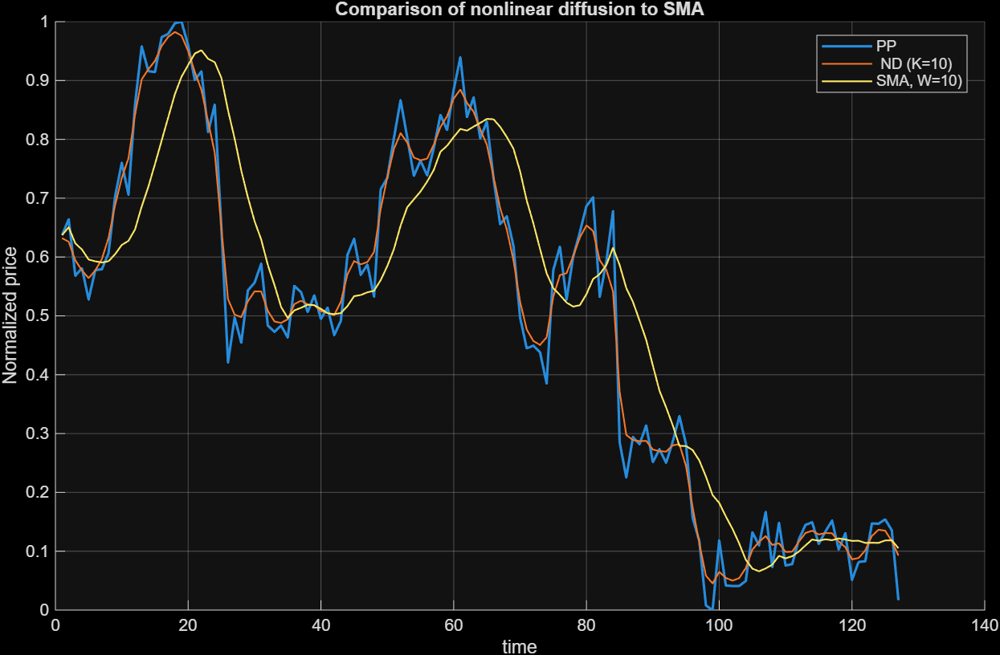

# Nonlinear Diffusion for Market Trend Extraction

An exploratory quantitative research project applying Partial Differential Equation (PDE) based nonlinear diffusion to 1D financial time-series data. 

This repository demonstrates how techniques traditionally used in image processing (such as the Perona-Malik filter) can be utilized for market regime analysis. The goal is to extract underlying macroeconomic trends and smooth out high-frequency market noise without suffering from the phase lag inherent in traditional moving averages.

## The Problem: Phase Lag in Moving Averages

Traditional trend-following indicators, like the Simple Moving Average (SMA), are widely used to filter market noise. However, they suffer from a significant drawback: **lag**. When a sudden market shock or regime shift occurs (e.g., an earnings gap), an SMA "blurs" the edge and takes time to catch up, leading to delayed trading signals.

## Mathematical Approach: 1D Nonlinear Diffusion

To overcome this, this project models the price series $u(x,t)$ as a 1D heat distribution and applies a nonlinear diffusion equation:

$$
\frac{\partial u}{\partial t} = \frac{\partial}{\partial x} \left( g\left(\left|\frac{\partial u}{\partial x}\right|\right) \frac{\partial u}{\partial x} \right)
$$

Where:

* $t$ represents the artificial "diffusion time" (smoothing iterations).
* $x$ represents the discrete time index of the historical market data.
* $g(\cdot)$ is the diffusion coefficient function that limits diffusion across large gradients (sharp price jumps).

### Diffusion coefficient function (Edge Detection)

The core of the edge-preserving smoothing is function $g(\cdot)$. Based on the Perona-Malik model, this project implements the coefficient as:

$$
g\left(\left|\frac{\partial u}{\partial x}\right|\right) = \frac{1}{1 + K \left|\frac{\partial u}{\partial x}\right|^2}
$$

Where:
* $\left|\frac{\partial u}{\partial x}\right|^2$ represents the squared spatial gradient of the price (analogous to local volatility or the magnitude of a price jump).
* $K$ is a tuned sensitivity parameter (threshold).

**How it works:** * **Noise Smoothing:** If the local price change is small (standard market noise), the gradient approaches zero, making $g \approx 1$. The equation acts like a standard linear heat equation, applying strong smoothing.
* **Edge Preservation:** If there is a sharp price jump (e.g., a regime shift or macroeconomic shock), the gradient is very large, driving $g \to 0$. This effectively halts the diffusion process at that specific point, preserving the structural "edge" of the new trend without blurring it.

### Boundary Conditions
The system is solved using **homogeneous Neumann boundary conditions** at the edges of the dataset:
$$\frac{\partial u}{\partial x} = 0 \quad \text{at} \quad x=0 \text{ and } x=N$$
This ensures zero flux at the boundaries, preventing artificial "leakage" of the trend values at the beginning and end of the price series.

## Results and Visualization

The algorithm was tested on historical PepsiCo stock data spanning 6 months with a 1-day sampling interval. The visualization compares the Nonlinear Diffusion (ND) approach against a standard Simple Moving Average (SMA).

  

**Key Observation:** While the SMA smooths the data, it significantly lags during sharp price drops. The ND curve effectively smooths the intra-regime noise but creates distinct "steps" that immediately track sharp volatility regime shifts, preserving the edges.

##  Quantitative Research Note: Look-Ahead Bias

It is critical to note that this specific PDE numerical scheme solves the diffusion process globally across the spatial domain $x$. Because the spatial discretization at point $x_i$ utilizes information from $x_{i+1}$ (future data points relative to $x_i$), the model inherently contains a **look-ahead bias**. 

Therefore, this tool is designed for **offline regime analysis, macro-trend extraction, and historical backtesting insights**, rather than low-latency live signal execution. 

## Repository Structure & Usage

* `pepsi_trend.m`: The core MATLAB script containing the numerical scheme and visualization logic.
* `data/`: Contains the historical CSV dataset used for the analysis.

To run the analysis, simply execute the `.m` script in your MATLAB environment. Ensure the `data/` folder is in your working directory path.
